# GrowLife: Environment Monitoring of Indoor Plants

## Summary
Some buildings do not have enough sunlight or humidity to grow indoor plants. This project will help determine which areas in a building are the best spots to grow plants by measuring the amount of light and humidity that different rooms receive. Once it is determined that a certain room is not getting enough light or humidity, a Twitter tweet will be sent to inform the building owner about it, so that they can either change the room’s light or humidity, or so they know they should move the plant to another room. The owner will also be informed using red indicators.

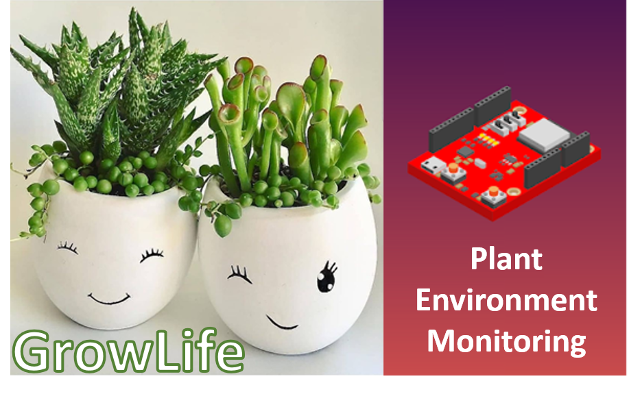</img>

## Bill of Materials
* 4 MacIot Boards (each include a light sensor, humidity sensor, and timer)
* PlatformIO Embedded Systems Framework (used its extension for Visual Studio Code)
* ThingSpeak Internet of Things API and Platform
* Twitter API
* Visual Studio Code

## Schematic

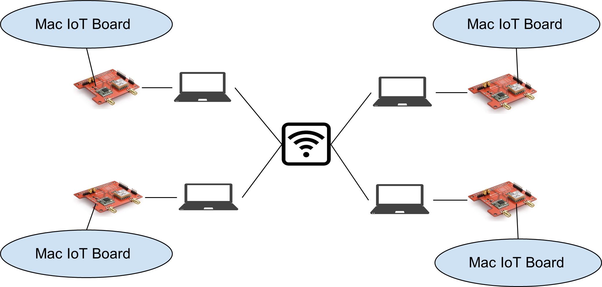</img>

## Software and Hardware Flow
Visual Studio Code was used to develop the application. The Visual Studio Code extension “PlatformIO” was used to set up a framework to develop C++ code that runs on the MacIoT boards. PlatformIO allowed us to build the code, upload it to the board, then monitor the output. In the C++ code, ThingSpeak Write API and the WiFi credentials were entered so that the MacIoT board had the information it needed to send data to the right ThingSpeak channel when it was connected to a laptop. Once the ThingSpeak channel received data, it displayed and analyzed it in its visualizations and data analytics section in the form of graphs and indicators. 

ThinkSpeak was also connected to the Twitter API using Twitter credentials, and whenever the luminosity dropped below 75 lux or whenever the relative humidity dropped below 25% in a room, ThingSpeak sent out a tweet using the Twitter API. Four different rooms (Ilker’s room, Brandon’s room, Dazana’s room and Sanil’s room) all sent luminosity and humidity data to the ThingSpeak channel, so that meant that four different rooms were monitored for optimal plant environment conditions.

### Flow Chart

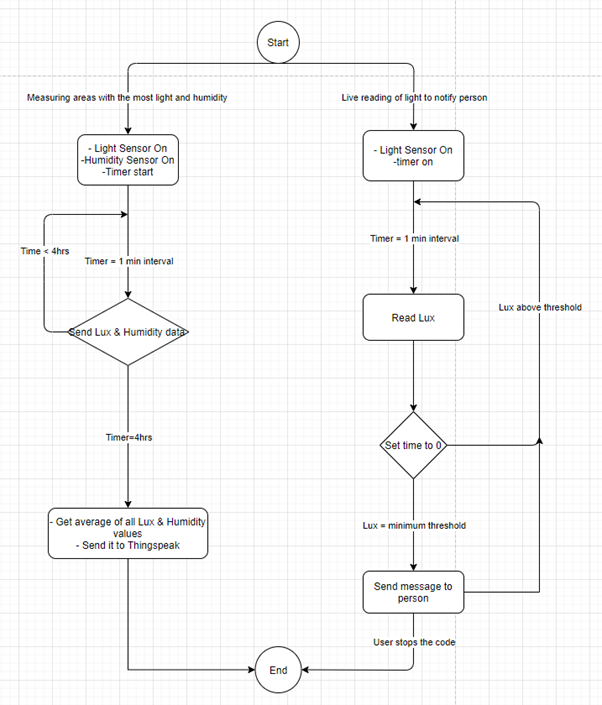</img>

## Software and Apps Used
* PlatformIO Embedded Systems Framework (used its extension for Visual Studio Code): https://marketplace.visualstudio.com/items?itemName=platformio.platformio-ide
* ThingSpeak Internet of Things API and Platform: https://thingspeak.com/
* Twitter API: https://developer.twitter.com/en/docs/twitter-api
* Visual Studio Code: https://code.visualstudio.com/

## Algorithm
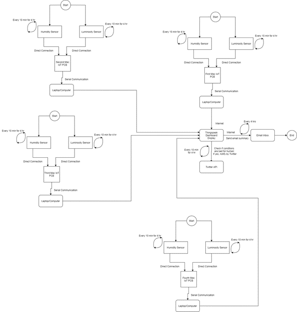</img>

## Videos and Images

### Video Walkthrough
https://vimeo.com/495902592

### Terminal Output
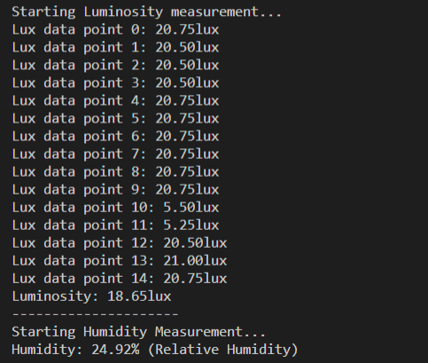</img>

### ThingSpeak Channel's Dashboard
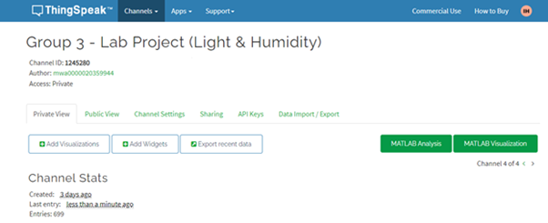</img>
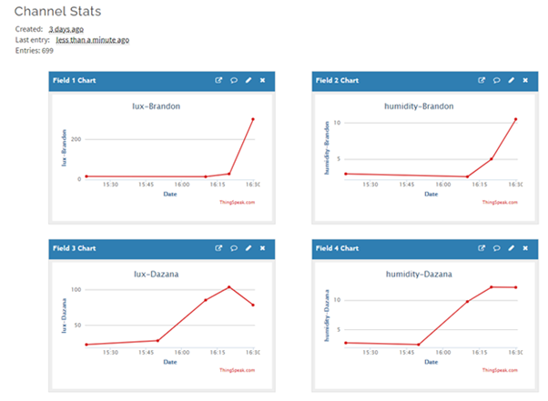</img>
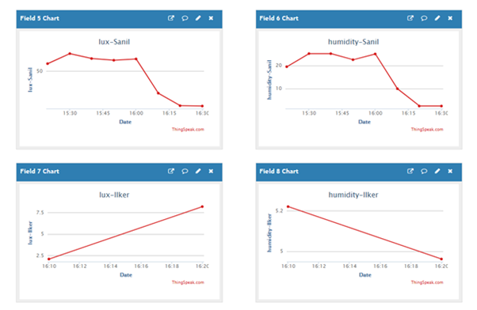</img>
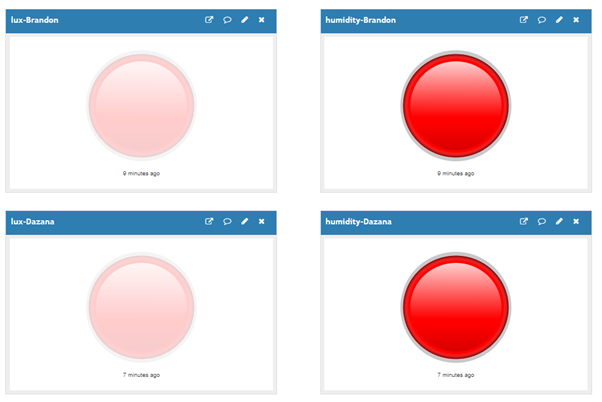</img>
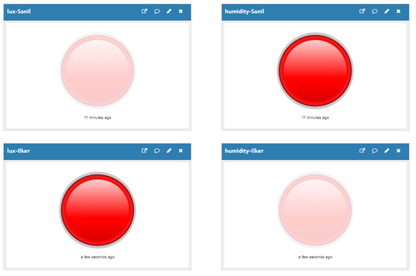</img>
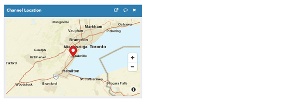</img>

### ThingSpeak Channel's React App
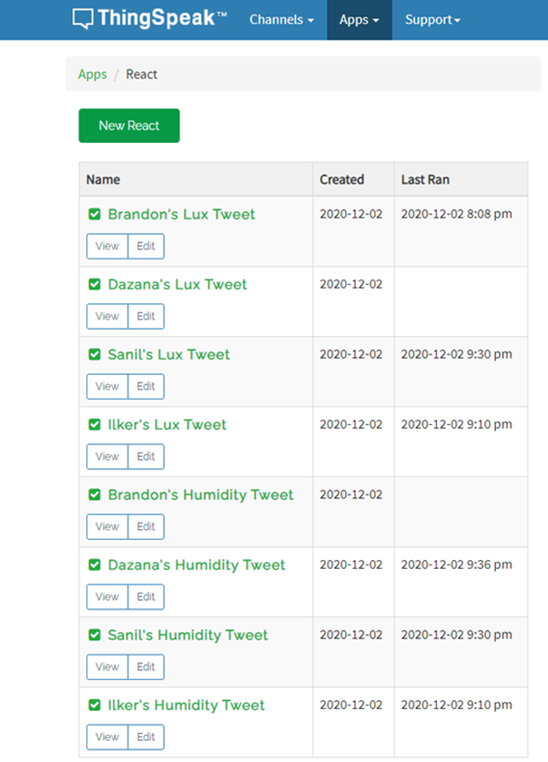</img>
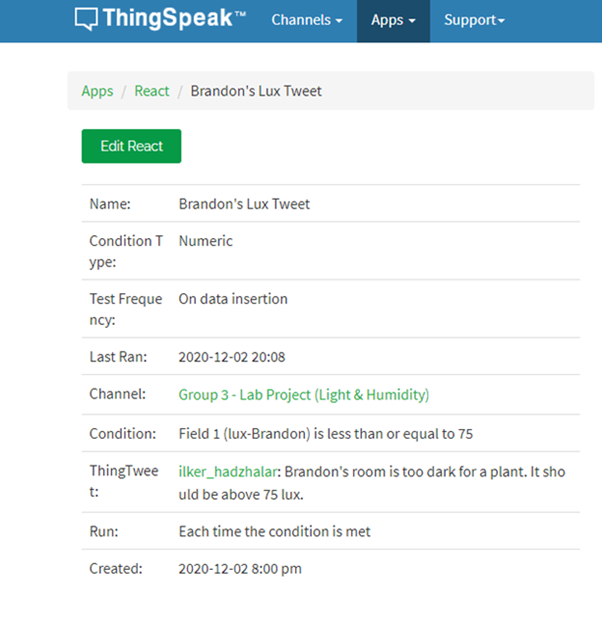</img>
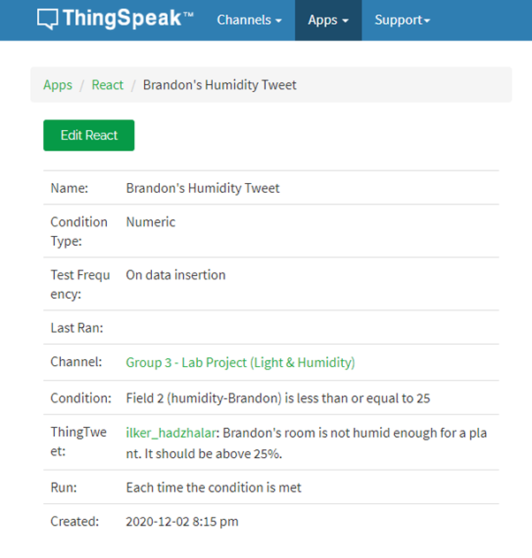</img>

### Twitter Notifications
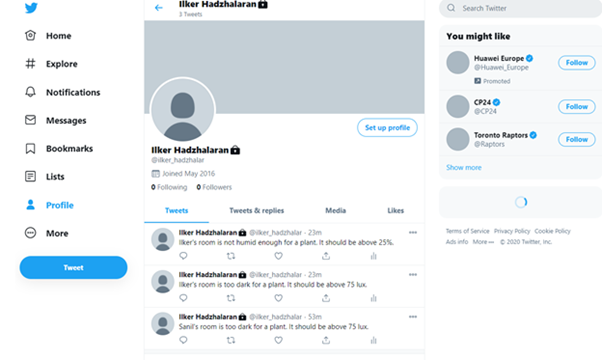</img>
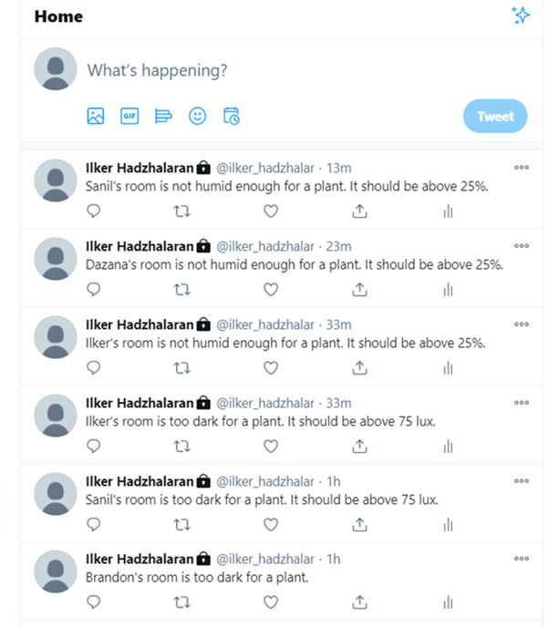</img>

## Conclusion and Future Applications
In this project, four different rooms were monitored for their luminosity and humidity conditions in order to determine which rooms were good enough for growing indoor plants. Whenever a room had luminosity or humidity that was too low, a tweet was sent so that the plant owners knew which rooms were not good enough for the plants to live in. A red light indicator was also turned on whenever a room did not have good enough plant conditions. There was also a widget that shows the channel location.

This can be extended to work for entire office buildings in a city so that building managers could be notified when they need to change the building conditions or when they need to move plants to different locations. This will improve building managers’ abilities to include indoor plants in as many rooms as possible so that the people in the building can have a more natural environment to work in. This can also inform building managers when it is time to repair a light bulb, improve the buildings’ lighting system, or improve the building’s humidity system. The widget that shows the channel location can also be used by a building manager that manages different buildings at different locations.
